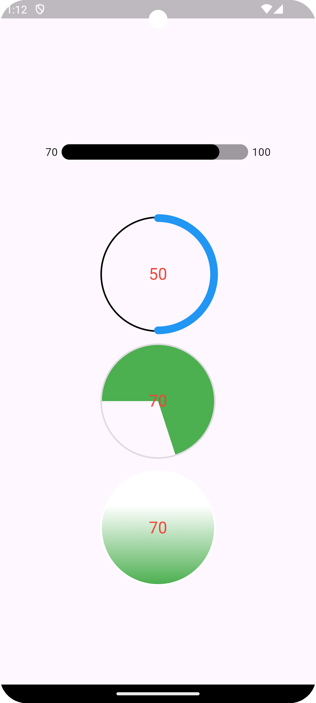

## Features

This package provide you percentages custom widgets with animations such as linear, circular, circle
and gradient circle percentages.

## Getting started

Version Minimum Flutter SDK: 2.12.0

Tested Versioning: <br />
Flutter SDK version: 3.22.1 <br />
Dart Version: 3.4.1 <br />

## Usage

<p align="left">
  <a title="simulator_image"></a>
</p>

### Linear Percentage

| Parameters              | Description                                                                                                                         |
|-------------------------|-------------------------------------------------------------------------------------------------------------------------------------|
| `currentPercentage`     | current percentage - start value (>= 0)                                                                                             |
| `maxPercentage`         | maximum percentage (currentPercentage <= maxPercentage)                                                                             |
| `backgroundHeight`      | background height                                                                                                                   |
| `percentageHeight`      | percentage height                                                                                                                   |
| `duration`              | duration for the animation (duration == null or duration >= 0)                                                                      |
| `backgroundDecoration`  | decoration for background                                                                                                           |
| `percentageDecoration`  | decoration for percentage                                                                                                           |
| `backgroundColor`       | background color                                                                                                                    |
| `percentageColor`       | percentage color                                                                                                                    |
| `leftRightText`         | Enum value for the left and right text (min and max value) - accepted value `leftOnly`, `rightOnly`, `both`, `none` (default value) |
| `leftTextStyle`         | text style for left text                                                                                                            |
| `rightTextStyle`        | text style for right text                                                                                                           |
| `leftTextRightPadding`  | text left padding from the percentage                                                                                               |
| `rightTextRightPadding` | text right padding from the percentage                                                                                              |

### Circular Percentage

| Parameters              | Description                                                    |
|-------------------------|----------------------------------------------------------------|
| `currentPercentage`     | current percentage - start value (>= 0)                        |
| `maxPercentage`         | maximum percentage (currentPercentage <= maxPercentage)        |
| `size`                  | circular percentage size                                       |
| `duration`              | duration for the animation (duration == null or duration >= 0) |
| `strokeWidth`           | stroke width                                                   |
| `backgroundStrokeWidth` | background stroke width                                        |
| `percentageColor`       | percentage color                                               |
| `backgroundColor`       | background color                                               |
| `textStyle`             | text style for the center text                                 |

### Circle Percentage

| Parameters              | Description                                                    |
|-------------------------|----------------------------------------------------------------|
| `currentPercentage`     | current percentage - start value (>= 0)                        |
| `maxPercentage`         | maximum percentage (currentPercentage <= maxPercentage)        |
| `size`                  | circular percentage size                                       |
| `duration`              | duration for the animation (duration == null or duration >= 0) |
| `percentageStrokeWidth` | stroke width                                                   |
| `backgroundStrokeWidth` | background stroke width                                        |
| `percentageColor`       | percentage color                                               |
| `backgroundColor`       | background color                                               |
| `textStyle`             | text style for the center text                                 |

### Gradient Circle Percentage

| Parameters              | Description                                                    |
|-------------------------|----------------------------------------------------------------|
| `currentPercentage`     | current percentage - start value (>= 0)                        |
| `maxPercentage`         | maximum percentage (currentPercentage <= maxPercentage)        |
| `size`                  | circular percentage size                                       |
| `duration`              | duration for the animation (duration == null or duration >= 0) |
| `percentageStrokeWidth` | percentage stroke width                                        |
| `backgroundStrokeWidth` | background stroke width                                        |
| `bottomColor`           | bottom color                                                   |
| `topColor`              | top color                                                      |
| `backgroundColor`       | background circle color                                        |
| `textStyle`             | text style for the center text                                 |

```dart
import 'package:flutter/material.dart';
import 'package:percentages_with_animation/percentages_with_animation.dart';

void main() {
  runApp(const MyApp());
}

class MyApp extends StatelessWidget {
  const MyApp({super.key});

  @override
  Widget build(BuildContext context) {
    return MaterialApp(
      title: 'Percentage With Animation Example',
      debugShowCheckedModeBanner: false,
      theme: ThemeData(
        colorScheme: ColorScheme.fromSeed(seedColor: Colors.deepPurple),
        useMaterial3: true,
      ),
      home: const MyHomePage(),
    );
  }
}

class MyHomePage extends StatefulWidget {
  const MyHomePage({super.key});

  @override
  State<MyHomePage> createState() => _MyHomePageState();
}

class _MyHomePageState extends State<MyHomePage> {
  @override
  Widget build(BuildContext context) {
    return Scaffold(
      body: Center(
        child: Column(
          mainAxisAlignment: MainAxisAlignment.center,
          children: <Widget>[
            Padding(
              padding: const EdgeInsets.all(59.0),
              child: LinearPercentage(
                currentPercentage: 70,
                maxPercentage: 100,
                height: 20,
                heightPercentage: 20,
                leftRightText: LeftRightText.both,
                backgroundDecoration: BoxDecoration(
                  borderRadius: BorderRadius.circular(10),
                  color: Colors.black38,
                ),
                percentageDecoration: BoxDecoration(
                  borderRadius: BorderRadius.circular(10),
                  color: Colors.black,
                ),
              ),
            ),
            const SizedBox(
              height: 15,
            ),
            const CircularPercentage(
              currentPercentage: 50,
              maxPercentage: 100,
              size: 150,
              duration: 2000,
              strokeWidth: 10,
              color: Colors.blue,
              backgroundColor: Colors.black,
              backgroundStrokeWidth: 2,
              textStyle: TextStyle(
                color: Colors.red,
                fontSize: 21,
              ),
            ),
            const SizedBox(
              height: 15,
            ),
            const CirclePercentage(
              currentPercentage: 70,
              maxPercentage: 100,
              size: 150,
              duration: 2000,
              strokeWidth: 10,
              color: Colors.green,
              backgroundStrokeWidth: 2,
              textStyle: TextStyle(
                color: Colors.red,
                fontSize: 21,
              ),
            ),
            const SizedBox(
              height: 15,
            ),
            const GradientCirclePercentage(
              currentPercentage: 70,
              maxPercentage: 100,
              size: 150,
              duration: 2000,
              strokeWidth: 10,
              bottomColor: Colors.green,
              backgroundStrokeWidth: 2,
              textStyle: TextStyle(
                color: Colors.red,
                fontSize: 21,
              ),
            ),
          ],
        ),
      ),
    );
  }
}
```

## Additional information

TODO: Tell users more about the package: where to find more information, how to
contribute to the package, how to file issues, what response they can expect
from the package authors, and more.
